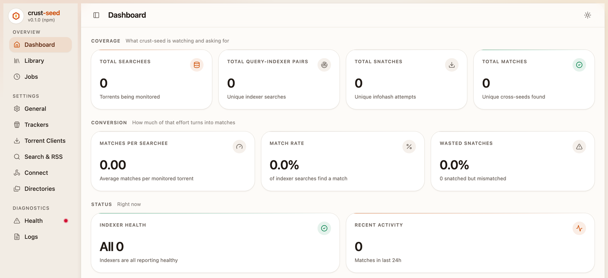
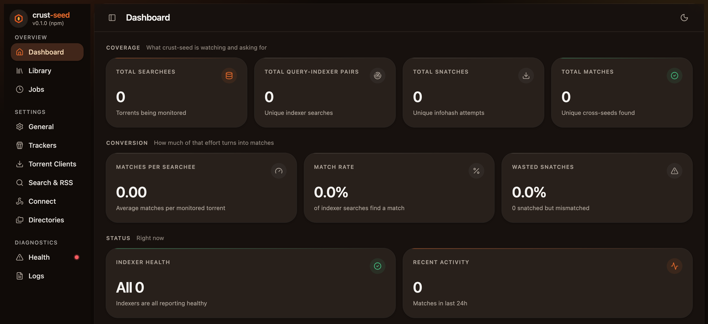

<p align="center">
  
</p>

<h1 align="center">crust-seed</h1>

<p align="center">
  <strong>Fully-automatic cross-seeding with Torznab — a Rust rewrite of cross-seed.</strong>
</p>

<p align="center">
  <a href="https://github.com/JohanDevl/crust-seed/actions/workflows/docker.yml"></a>
  <a href="https://github.com/JohanDevl/crust-seed/actions/workflows/audit.yml"></a>
  <a href="https://github.com/JohanDevl/crust-seed/releases/latest"></a>
  <a href="https://github.com/JohanDevl/crust-seed/pkgs/container/crust-seed"></a>
  
  <a href="LICENSE"></a>
</p>

---

crust-seed finds torrents you can cross-seed from content you already have. It
searches your indexers for releases that match your existing downloads, and
either saves the `.torrent` files or injects them straight into your client,
linking the data into place so nothing is downloaded twice.

It is a port of [cross-seed](https://github.com/cross-seed/cross-seed) 7.x to
Rust: same matching logic, same option names, same API surface, one static
binary instead of a Node runtime. See
[Differences from cross-seed](#differences-from-cross-seed) for the three
places it deliberately diverges.

## What it does

- **Search** every torrent in your client (or on disk) against your Torznab
  indexers, on a schedule or on demand.
- **RSS** — poll each indexer's recent releases and match them as they appear.
- **Announce/webhook** — match a single release the moment autobrr sees it.
- **Inject** matched torrents into qBittorrent, rTorrent, Transmission or
  Deluge, hardlinking/symlinking/reflinking the data so the client can seed it
  without a second copy.
- **Web UI** for configuration, indexer management, statistics, health checks
  and live logs.

<p align="center">
  
  
</p>

## Requirements

- Any indexers that support Torznab (via Prowlarr or Jackett)
- At least one torrent client: qBittorrent, rTorrent, Transmission or Deluge

## Running with Docker

```bash
docker run -d \
  --name crust-seed \
  -p 2468:2468 \
  -v /path/to/config:/config \
  -v /path/to/torrents:/torrents \
  -v /path/to/data:/data \
  -v /path/to/links:/links \
  ghcr.io/johandevl/crust-seed:latest
```

Or with Compose. Copy [`docker-compose.yml`](docker-compose.yml), replace the
three `/path/to/...` placeholders, then:

```bash
mkdir -p ./config && sudo chown -R 65532:65532 ./config
docker compose up -d
```

The container runs as UID/GID `65532:65532`; `chown` the config volume to match.

Then open <http://localhost:2468> and create the first user. The signup window
closes five minutes after startup — restart the container if you miss it.

Image tags:

| Tag        | Points at                              |
| ---------- | -------------------------------------- |
| `latest`   | the most recent build of `main`        |
| `vX.Y.Z`   | a specific release                     |
| `develop`  | the most recent build of `develop`     |

## Running from source

```bash
# Build the web UI (needs Node 26+)
npm -C web ci
npm -C web run build

# Build and run
cargo build --release
./target/release/crust-seed daemon
```

The web UI is embedded into the binary at compile time. Building without it
produces a working daemon whose UI shows a placeholder page.

## Configuration

There is no config file. Every option — indexers, torrent clients, link
directories, schedules, notifications — is set in the Web UI and stored in the
database next to it (`/config` in Docker, `~/.crust-seed` otherwise), so the
running settings and what you see on screen can never disagree.

Two things live outside that database, because they are needed before it is
read:

- `CONFIG_DIR` — where the database, logs and torrent cache go. The Docker
  image sets it to `/config`.
- A handful of per-invocation CLI flags (`--port`, `--host`, `--base-path`,
  `--inject-dir`, …). They override the stored settings for one run and are
  never written back.

Coming from cross-seed, re-enter the settings from your `config.js` in the Web
UI, then set the API key you already had so existing webhooks keep working:

```bash
crust-seed api-key --api-key <your-existing-key>
```

## Commands

```
crust-seed daemon                        # web UI + scheduled jobs
crust-seed search                        # one-off search of everything
crust-seed rss                           # one-off RSS scan
crust-seed inject                        # inject saved .torrent files
crust-seed restore                       # restore the torrent cache to outputDir
crust-seed diff <a.torrent> <b.torrent>  # explain why two torrents do or don't match
crust-seed tree <torrent>                # print a torrent's file tree
crust-seed api-key                       # show (or set) the API key
crust-seed --help                        # everything else
```

## API

With the API key in an `X-Api-Key` header or an `apikey` query parameter:

| Endpoint            | Purpose                                    |
| ------------------- | ------------------------------------------ |
| `POST /api/announce` | match a single release (autobrr)          |
| `POST /api/webhook`  | search for one torrent by infoHash or path |
| `POST /api/job`      | run a job ahead of schedule                |
| `GET  /api/status`   | authenticated health check                 |
| `GET  /api/ping`     | unauthenticated health check               |
| `/api/indexer/v1/*`  | indexer CRUD (Prowlarr integration)        |

## Differences from cross-seed

crust-seed aims to do the same things as cross-seed 7.x, and its Web UI is
cross-seed's React app — restyled and rebranded, but the same components
driving the same tRPC calls. Three things are deliberately different:

- **No configuration file at all.** cross-seed's `config.js` is executable
  JavaScript that its Node daemon evaluates, and a Rust binary cannot evaluate
  it. Rather than invent a declarative file that would immediately drift from
  whatever the Web UI writes, crust-seed keeps every option in the database and
  makes the Web UI the only place to change it.
- **No in-place upgrade from an existing `cross-seed.db`.** crust-seed creates
  its own database and rebuilds its caches from your client and data
  directories on first run. Search history is not carried over.
- **qBittorrent API keys.** cross-seed only authenticates with a username and
  password. crust-seed also accepts the stateless API keys added in qBittorrent
  5.2 (Preferences → Web UI → API Key), written in place of the username with
  no password: `qbittorrent:http://qbt_yourkeyhere@localhost:8080`. In the Web
  UI, the client form has a "Use an API key instead of a login" toggle that
  swaps the User and Password fields for an API Key field. Password
  authentication is unchanged.

Some names still say *cross-seed* on purpose: the qBittorrent tag and category
suffix, the default `linkCategory`, the `outputDir` name and the session
cookie. They identify things that already exist in your client and on your
disk, and renaming them would orphan every torrent injected so far.

## Contributing

See [CONTRIBUTING.md](CONTRIBUTING.md).

## Credits

cross-seed is the work of [Michael Goodnow](https://github.com/mmgoodnow) and
its contributors. This is a port of their design and their matching logic to
Rust; the web UI is theirs, vendored under `web/` and restyled.

## License

[Apache-2.0](LICENSE), the same as cross-seed. See [NOTICE](NOTICE) for
attribution.
